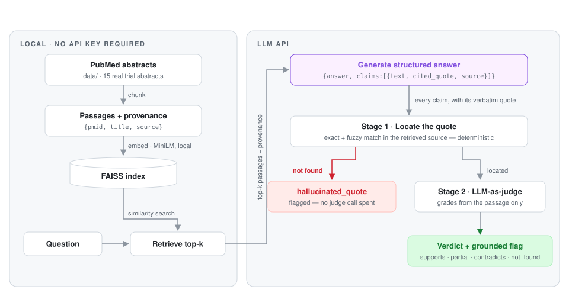

<div align="center">

# LitRAG

**A citation-faithfulness benchmark over the medical literature — and the small, readable RAG pipeline it measures.**

[](https://github.com/nickjlamb/litrag/actions/workflows/ci.yml)
[](https://www.python.org/downloads/)
[](LICENSE)
[](https://github.com/astral-sh/ruff)
[](https://www.pharmatools.ai/litrag)

</div>

---

The heart of this repo is a **benchmark**: a 61-claim hand-labelled gold set over real medical abstracts, scored head-to-head against the faithfulness metrics of RAGAS and DeepEval with the same Claude judge for all three systems — including the row where this implementation loses. The pipeline around it is a small, readable RAG over the medical literature whose every claim must carry a verbatim cited quote; it exists so the benchmark has something honest to measure.

The model must return, for every claim it makes, a **verbatim quote** from a retrieved passage plus the PMID it came from. A two-stage eval then verifies each citation:

1. **Locate** — a deterministic string check (normalize + fuzzy match) confirms the quote really exists in the source. A fabricated quote is caught here, for free, before any judge is called.
2. **Judge** — an LLM-as-judge grades whether the located passage actually *supports* the claim: `supports` / `partial` / `contradicts` / `not_found`.

Embedding and retrieval run fully local (Hugging Face `sentence-transformers` + FAISS — no managed vector-DB key). Only generation and the judge call an LLM API.

## The benchmark

61 hand-labelled claims over the sample corpus, each labelled twice — does the *cited quote* exist verbatim, and does the *passage* support the *claim* — scored against the faithfulness metrics of RAGAS and DeepEval with the same Claude judge model for all three systems. Full methodology, per-case error analysis, and caveats in [`benchmark/`](benchmark/).

| | LitRAG | RAGAS | DeepEval |
|---|---|---|---|
| Accuracy | **0.984** | 0.934 | 0.803 |
| Hallucination recall | **1.000** | 0.912 | 0.647 |
| Hallucination precision | 0.971 | 0.969 | **1.000** |
| F1 | **0.986** | 0.939 | 0.786 |
| Judge calls | **52 of 61** | 61 × 2 stages | 61 × 2 stages |
| Wall time (61 claims) | **177 s** | 355 s | 863 s |

Where the numbers cut against LitRAG, they're reported: its one error in 61 is a **false alarm** — a genuinely faithful claim flagged by the judge — which is why DeepEval's precision is higher. That error fails in the safe direction for medicine; DeepEval's twelve errors are all misses scored exactly 1.00.

The separating case is a *true* claim citing a *fabricated* quote: both frameworks pass it with a perfect score, because they judge the claim and never see the citation. The deterministic locator flags it without spending a judge call — the case that separates citation checking from claim checking.

## Architecture

<picture>
  <source media="(prefers-color-scheme: dark)" srcset="docs/architecture-dark.svg">
  
</picture>

Built on [LangChain](https://python.langchain.com/) (orchestration), [Hugging Face sentence-transformers](https://www.sbert.net/) (embeddings), and [FAISS](https://github.com/facebookresearch/faiss) (vector store). The judge deliberately drops to the raw [Anthropic SDK](https://github.com/anthropics/anthropic-sdk-python) for forced tool use and prompt caching — see [Framework notes](docs/framework-notes.md) for why.

## Quick start

```bash
git clone https://github.com/nickjlamb/litrag.git && cd litrag
python -m venv .venv && source .venv/bin/activate
pip install -r requirements.txt
cp .env.example .env       # add ANTHROPIC_API_KEY for generation + judge
python demo.py
```

The demo ingests a corpus of 15 real semaglutide abstracts, builds the FAISS index (first run downloads the ~90 MB embedding model, then it's offline), asks three questions — two answerable from the corpus, one deliberately *not* — and grades every claim (output abridged):

```text
================================================================================
Q1: By how much does semaglutide reduce major adverse cardiovascular events ...
================================================================================

ANSWER: In adults with overweight or obesity and established cardiovascular
disease but without diabetes, semaglutide reduced major adverse cardiovascular
events by 20% versus placebo (hazard ratio 0.80; 95% CI 0.72–0.90). ...

  Retrieved: 37952131, 38740993, 33567185, 34706925
  Faithfulness: GROUNDED  (3 claims, 0 flagged)
    [OK ] supported        [PMID 37952131] Semaglutide reduced MACE by 20% vs placebo
    ...

================================================================================
Q3: Does semaglutide reduce the risk of dementia or cognitive decline?
================================================================================

ANSWER: The provided passages do not address dementia or cognitive decline. ...
  Faithfulness: GROUNDED  (0 claims, 0 flagged)   # honest abstention — no invented support
```

**No API key?** Retrieval works without one:

```bash
python index.py    # builds the index and runs a sample similarity search, fully local
```

## Live ingestion via PubCrawl

The static sample corpus is only the starting point. `ingest.py` can pull fresh abstracts straight from PubMed through the [PubCrawl](https://www.pharmatools.ai/pubcrawl) MCP server — our own literature tool (`search_pubmed` → `get_abstract`, no API key):

```bash
npm install -g @pharmatools/pubcrawl   # one-time; ingest.py spawns it over stdio

python ingest.py --from-pubcrawl "GLP-1 agonists chronic kidney disease" \
    --max-results 15 --save data/glp1_ckd.md
python demo.py   # or: load_documents(path="data/glp1_ckd.md")
```

The pulled corpus is written in the same documented `## PMID:` / `**Title:**` / `**Source:**` format as the sample, so it's a drop-in replacement anywhere the pipeline takes a corpus path. No Node? `--via eutils` fetches directly from NCBI E-utilities instead.

NCBI rate-limits E-utilities to 3 requests/second without a key; ingestion retries transient 429s with backoff automatically. For the 10 req/s tier, get a free key from your [NCBI account](https://www.ncbi.nlm.nih.gov/account/settings/) and `export NCBI_API_KEY=...` — it's forwarded to the PubCrawl server.

## Examples

Runnable, focused scripts live in [`examples/`](examples/):

| Example | What it shows | API key |
|---|---|---|
| [`01_retrieval_only.py`](examples/01_retrieval_only.py) | Build/load the index and inspect top-k passages for a query | none |
| [`02_ask_with_citations.py`](examples/02_ask_with_citations.py) | One question end-to-end: structured answer with per-claim verbatim quotes | required |
| [`03_catch_a_hallucination.py`](examples/03_catch_a_hallucination.py) | Feed the eval a fabricated citation and watch Stage 1 flag it — no judge call needed | none |
| [`04_bring_your_own_corpus.py`](examples/04_bring_your_own_corpus.py) | Point the pipeline at your own abstracts file | none for retrieval |

## Project layout

| File | Role |
|------|------|
| [`ingest.py`](ingest.py) | Load the abstract corpus, chunk into passages with `{pmid, title, source}` metadata |
| [`index.py`](index.py) | Build/load the FAISS index from `sentence-transformers` embeddings |
| [`rag.py`](rag.py) | LangChain retrieval + generation chain; returns the answer **with** per-claim cited quotes |
| [`faithfulness.py`](faithfulness.py) | Two-stage citation-faithfulness eval: deterministic quote locator → LLM-as-judge |
| [`demo.py`](demo.py) | End-to-end run: ingest → index → ask → answer → grade |
| [`data/`](data/) | 15 real semaglutide abstracts (STEP, SELECT, SUSTAIN…) so the repo runs key-free for retrieval |

A reviewer can read the whole pipeline in about ten minutes — that's deliberate.

## Why the eval is two-stage

The locator + judge design is not original to this repo: it is ported from a cookbook citation-faithfulness notebook (a cheap, unspoofable string check in front of an LLM judge that grades only from the passage). What is original here is the benchmark above — the gold set, the head-to-head, and the error analysis.

A single LLM-as-judge can be argued with; a string match can't. Requiring a verbatim quote per claim turns hallucination detection into two cheap, complementary checks:

- **The locator is unspoofable.** If the model invents a quote, `rapidfuzz.partial_ratio` against the retrieved passages fails, and the claim is flagged as `hallucinated_quote` without spending a judge call. Paraphrases below the 90-point threshold are rejected too — verbatim means verbatim.
- **The judge grades only from the passage.** With the quote located, the judge answers a narrower, easier question: does *this passage* support *this claim*? It's forbidden from using outside knowledge, forced into a structured verdict via tool use, and the passage block is prompt-cached so grading many claims against one source is cheap.

An answer that honestly abstains ("the sources don't say") makes no claims and is grounded by definition.

## Framework notes

The pipeline is implemented in LangChain; [docs/framework-notes.md](docs/framework-notes.md) is an honest, from-the-build write-up of where the framework earned its keep (`Document` metadata plumbing, `with_structured_output`) and where the project dropped to the raw SDK on purpose (the judge needs forced tool use + per-block prompt caching that the abstraction hides). It also maps the design onto LlamaIndex primitive-by-primitive and explains why swapping frameworks isn't a free lunch here.

## Roadmap

- [x] **Live corpus ingestion** — pull fresh abstracts from PubMed via the [PubCrawl](https://www.pharmatools.ai/pubcrawl) MCP server (with an NCBI E-utilities fallback) instead of the static sample — see [Live ingestion via PubCrawl](#live-ingestion-via-pubcrawl)
- [ ] **LlamaIndex variant** — a small `rag_llamaindex.py` so the framework comparison is code, not prose
- [x] **Benchmark the eval** — score the faithfulness judge against RAGAS and DeepEval faithfulness metrics on a labelled claim set — see [benchmark/](benchmark/) and [How it benchmarks](#how-it-benchmarks)
- [ ] **Larger corpora** — beyond one drug: multi-topic corpora and retrieval quality metrics (recall@k against known-relevant PMIDs)
- [ ] **CLI** — `litrag ask "..."` entry point with `--corpus` and `--judge` flags

Suggestions welcome — open an [issue](https://github.com/nickjlamb/litrag/issues).

## Contributing

Contributions are welcome — see [CONTRIBUTING.md](CONTRIBUTING.md) for dev setup, test and lint commands, and PR guidelines. Notable changes are tracked in [CHANGELOG.md](CHANGELOG.md).

```bash
pip install -r requirements.txt && pip install ruff
pytest            # quote-locator tests run without any API key
ruff check .
```

## Citation

If you use LitRAG in your work, please cite it (see [`CITATION.cff`](CITATION.cff)):

```bibtex
@software{lamb_litrag_2026,
  author = {Lamb, Nick},
  title  = {LitRAG: grounded literature RAG with a citation-faithfulness eval},
  year   = {2026},
  url    = {https://github.com/nickjlamb/litrag}
}
```

## License

[MIT](LICENSE) © 2026 [Nick Lamb](https://www.pharmatools.ai)
